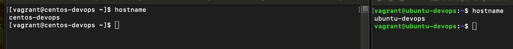
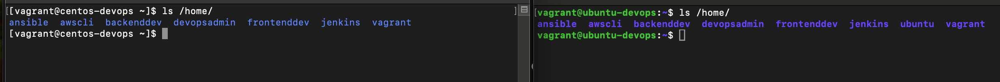
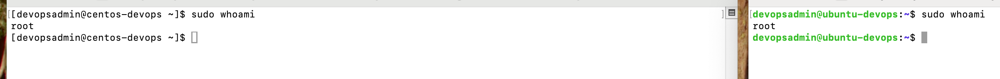

# FameTech DevOps Lab – Dual-OS Provisioning & Access Management

This repository showcases a real-world infrastructure provisioning lab I completed during my project-based DevOps role at **FameTech NYC**, where I worked as part of an infrastructure team for the fictional client **CloudVerse Corp**.

In this lab, I provisioned two Linux environments (CentOS 7 & Ubuntu 22.04) using Vagrant, configured secure SSH access, created system users and groups, and enforced baseline access control and hardening practices across both systems. All tasks reflect standard operating procedures in enterprise DevSecOps environments.

All experiences and simulations are **verifiable upon request** through FameTech NYC.

---

## Lab Metadata

| Field            | Value                                                          |
| ---------------- | -------------------------------------------------------------- |
| **Lab ID**       | CV-LAB-001                                                     |
| **Sprint**       | Sprint 4                                                       |
| **Client**       | CloudVerse Corp (via FameTech NYC)                             |
| **Engineer**     | Sheikh Ahmed                                                   |
| **Environments** | CentOS 7, Ubuntu 22.04                                         |
| **Tools Used**   | Vagrant, VirtualBox, SSH, Bash, visudo, systemctl, sshd_config |

---

## Ticket: CV-DEVOPS-100 – Multi-OS Provisioning & Access Hardening

> CloudVerse Corp is onboarding new development teams and needs a reproducible setup with CentOS and Ubuntu VMs for staging. I was assigned to:
>
> - Provision both VMs with a single `Vagrantfile`
> - Configure memory, CPU, hostname, and networking
> - Add users and groups for engineering and automation teams
> - Harden SSH access and disable root login
> - Grant passwordless sudo access for lead DevOps engineers

---

## VM Provisioning Specs

| Item                | Value                                                                      |
| ------------------- | -------------------------------------------------------------------------- |
| **OS Boxes**        | `centos/7`, `ubuntu/jammy64`                                               |
| **Memory (per VM)** | 1024 MB                                                                    |
| **vCPUs**           | 1                                                                          |
| **Hostnames**       | `centos-devops`, `ubuntu-devops`                                           |
| **Access**          | SSH via `vagrant ssh`, `sudo` for root                                     |
| **Groups**          | `devops`, `backend`, `frontend`, `automation`                              |
| **Users**           | `devopsadmin`, `backenddev`, `frontenddev`, `jenkins`, `ansible`, `awscli` |

---

## Implementation Walkthrough

### Prerequisites

I ensured both **VirtualBox** and **Vagrant** were installed on my system:

```bash
vagrant --version
virtualbox --help
```

---

### Project Directory

```bash
mkdir -p ~/DevOps-Capstone/CV-LAB-001
cd ~/DevOps-Capstone/CV-LAB-001
```

---

### Vagrantfile Configuration (Dual OS Setup)

I initialized the Vagrant project:

```bash
vagrant init
```

Then replaced the default file with:

```ruby
Vagrant.configure("2") do |config|
  config.vm.define "centos-devops" do |centos|
    centos.vm.box = "centos/7"
    centos.vm.hostname = "centos-devops"
    centos.vm.network "private_network", type: "dhcp"
    centos.vm.provider "virtualbox" do |vb|
      vb.memory = "1024"
      vb.cpus = 1
    end
  end

  config.vm.define "ubuntu-devops" do |ubuntu|
    ubuntu.vm.box = "ubuntu/jammy64"
    ubuntu.vm.hostname = "ubuntu-devops"
    ubuntu.vm.network "private_network", type: "dhcp"
    ubuntu.vm.provider "virtualbox" do |vb|
      vb.memory = "1024"
      vb.cpus = 1
    end
  end
end
```

---

### VM Boot and SSH Check

```bash
vagrant up

vagrant ssh centos-devops
hostname
exit

vagrant ssh ubuntu-devops
hostname
exit
```

✔️ Verified hostnames and SSH access on both systems.

---

### Group & User Management

**Created Groups on Both VMs**:

```bash
groupadd devops
groupadd backend
groupadd frontend
groupadd automation
```

**CentOS: Added Users to Groups**

```bash
useradd -m -G devops devopsadmin
useradd -m -G backend backenddev
useradd -m -G frontend frontenddev
useradd -m -G automation jenkins
useradd -m -G automation ansible
useradd -m -G automation awscli
```

**Ubuntu: Used `adduser` Method**

```bash
adduser devopsadmin --ingroup devops
adduser backenddev --ingroup backend
adduser frontenddev --ingroup frontend
adduser jenkins --ingroup automation
adduser ansible --ingroup automation
adduser awscli --ingroup automation
```

---

### Password Setup

I set passwords for all users to enable secure access and testing:

```bash
passwd devopsadmin
passwd backenddev
# Repeated for other users
```

---

### Sudo Access Configuration

Edited the sudoers file using:

```bash
visudo
```

And appended the following line:

```bash
devopsadmin ALL=(ALL) NOPASSWD:ALL
```

Verified access by switching users:

```bash
su - devopsadmin
sudo ls /root
```

---

### SSH Hardening

I disabled root login via SSH for both VMs by editing:

```bash
sudo vim /etc/ssh/sshd_config
```

Changed:

```bash
PermitRootLogin no
```

Then restarted the SSH service:

```bash
sudo systemctl restart sshd    # CentOS
sudo systemctl restart ssh     # Ubuntu
```

---

## Validation Checklist

| Task                            | Status |
| ------------------------------- | ------ |
| Vagrantfile with dual OS config | ✅     |
| VM boot and SSH login           | ✅     |
| Hostname verification           | ✅     |
| Group creation                  | ✅     |
| User creation and mapping       | ✅     |
| Sudo access configured          | ✅     |
| Root SSH login disabled         | ✅     |
| Screenshots captured            | ✅     |

---

## Screenshots

Screenshots included under the `/screenshots` directory:

- `01_hostname_check.png`
  
- `02_useradd_success.png`
  
- `03_visudo_config.png`
  
- `04_ssh_hardening.png`
  [04_ssh_hardening](screenshots/04_ssh_hardening.png)

---

## Interview Q\&A

**Q1: Why use `visudo` instead of editing sudoers directly?**  
A: `visudo` validates syntax and prevents misconfiguration that could lock out sudo access.

**Q2: Why disable root login via SSH?**  
A: Disabling root login reduces brute force risk and enforces least privilege by requiring login as named users.

**Q3: What’s the benefit of using groups like `devops` and `automation`?**  
A: Role-based access control improves auditability, simplifies permission changes, and meets security standards like PCI-DSS and HIPAA.

**Q4: Why separate CentOS and Ubuntu setups?**  
A: Simulating cross-platform environments ensures tools and scripts are portable across different Linux distributions.

---

## FameTech Simulation Story

This lab is part of my project-based DevOps role at **FameTech NYC**, simulating Sprint 1 onboarding for **CloudVerse Corp**. I was responsible for setting up reproducible dual-OS VMs, enforcing baseline access control, and preparing the environments for upcoming CI/CD pipeline integration.

---

## Contact

**Engineer**: Sheikh Ahmed  
**Role**: DevOps Engineer – Infrastructure & Access Management  
**Location**: NYC  
**Verification**: Project history verifiable via FameTech references  
**GitHub**: [github.com/sheikhiahmed](https://github.com/sheikhiahmed)

---
