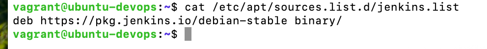

# FameTech DevOps Lab – Software Install & Service Control (Jenkins, Ansible, httpd)

> This lab simulates installing and managing enterprise DevOps software (Jenkins, Ansible, Apache) across CentOS and Ubuntu, with a focus on service lifecycle, package troubleshooting, and post-install validation — core skills for any production-ready DevOps engineer.

---

## About This Project

This lab was conducted under my project-based role at FameTech NYC, simulating CI/CD platform setup at CloudVerse Corp. I was responsible for installing critical tools via package managers, handling GPG keys, resolving dependencies, and ensuring services were boot-enabled and monitored.

> Experience modeled after production CI/CD pipelines in hybrid Linux environments.

---

## Lab Metadata

| Key          | Value                                                             |
| ------------ | ----------------------------------------------------------------- |
| Lab Title    | DevOps Software Install & Service Control                         |
| Lab ID       | CV-LAB-003                                                        |
| Company      | CloudVerse Corp                                                   |
| Engineer     | Sheikh Ahmed                                                      |
| Sprint       | Sprint 3                                                          |
| Environments | CentOS 7, Ubuntu 22.04                                            |
| Tools Used   | YUM, DNF, APT, RPM, systemctl, wget, GPG, ps, netstat, journalctl |

---

## Ticket: CV-DEVOPS-102

Jenkins agents are failing to deploy in staging due to missing packages and service misconfigurations. You’re tasked to:

- Install Jenkins, Ansible, htop, tree via proper package managers
- Add third-party repos for Jenkins
- Ensure all services are started, enabled, and validated
- Troubleshoot failed services and ports

---

## Installation Matrix

| OS           | Package Tool | Jenkins Setup       | Ansible Setup |
| ------------ | ------------ | ------------------- | ------------- |
| CentOS 7     | dnf, rpm     | Requires GPG & repo | EPEL repo     |
| Ubuntu 22.04 | apt          | Requires GPG & repo | Default repo  |

---

## Implementation Steps

### Step 1: Update Repositories

**CentOS:**

```bash
sudo yum update -y
sudo yum install epel-release -y
```

````

**Ubuntu:**

```bash
sudo apt update -y && sudo apt upgrade -y
````

---

### Step 2: Install htop and tree

```bash
# CentOS
sudo yum install -y htop tree

# Ubuntu
sudo apt install -y htop tree
```

---

### Step 3: Install Ansible

```bash
# CentOS
sudo yum install -y ansible

# Ubuntu
sudo apt install -y ansible
```

---

### Step 4: Add Jenkins Repo and Install Jenkins

**CentOS:**

```bash
sudo wget -O /etc/yum.repos.d/jenkins.repo https://pkg.jenkins.io/redhat-stable/jenkins.repo
sudo rpm --import https://pkg.jenkins.io/redhat-stable/jenkins.io-2023.key
sudo yum install -y java-17-openjdk-devel jenkins
```

**Ubuntu:**

```bash
sudo apt install -y openjdk-17-jdk

wget -q -O - https://pkg.jenkins.io/debian/jenkins.io-2023.key | sudo apt-key add -
echo "deb https://pkg.jenkins.io/debian-stable binary/" | sudo tee /etc/apt/sources.list.d/jenkins.list

sudo apt update
sudo apt install -y jenkins
```

---

### Step 5: Start and Enable Jenkins Service

```bash
sudo systemctl start jenkins
sudo systemctl enable jenkins
sudo systemctl status jenkins
```

---

### Step 6: Verify Installation

```bash
# Check versions
htop --version
ansible --version
java -version
jenkins --version

# Check Jenkins port
sudo netstat -tulnp | grep 8080

# Get Jenkins initial admin password
sudo cat /var/lib/jenkins/secrets/initialAdminPassword
```

---

### Step 7: Troubleshooting Common Errors

```bash
# View Jenkins logs
sudo journalctl -u jenkins -xe

# Restart Jenkins if needed
sudo systemctl restart jenkins

# Reload daemon
sudo systemctl daemon-reexec
```

---

## Validation Screenshots

Screenshots included under the /screenshots directory:

- `Package install`
  
- `Jenkins status`
  
- `Logs`
  
- `Repo Files`
  

| Step            | Description                                                               |
| --------------- | ------------------------------------------------------------------------- |
| Package install | Output from `ansible --version`, `jenkins --version`                      |
| Jenkins status  | Output of `systemctl status jenkins`                                      |
| Logs            | Output from `journalctl -u jenkins`                                       |
| Jenkins UI      | Screenshot of `localhost:8080` in a browser                               |
| Repo Files      | `/etc/yum.repos.d/jenkins.repo` or `/etc/apt/sources.list.d/jenkins.list` |

---

## Validation Checklist

- [ ] Jenkins installed using official repo and GPG key
- [ ] All tools start and enable without errors
- [ ] Jenkins accessible via browser on port 8080
- [ ] Log review and service restart confirmed
- [ ] Admin password retrieved and stored

---

## Interview Q\&A

**Q: Why import a GPG key before installing from a third-party repo?**
A: It verifies the authenticity of the package and prevents installing from untrusted or tampered sources.

**Q: Jenkins isn’t starting. What’s your first action?**
A: Check logs using `journalctl -u jenkins`, confirm port usage, then restart the service.

**Q: Why prefer package managers (dnf/apt) over downloading `.rpm` or `.deb` manually?**
A: Package managers handle dependency resolution, update tracking, and rollback support.

---

## Real-World Notes

- Jenkins is widely used for CI/CD pipelines, especially in Java and microservices projects.
- Ansible automates server setup, provisioning, and configuration across hybrid environments.
- Always confirm Jenkins port 8080 is open using firewalls or security groups (e.g., `ufw`, AWS SG).
- For cloud deployments, ensure persistent service startup via `systemctl enable`.

---
