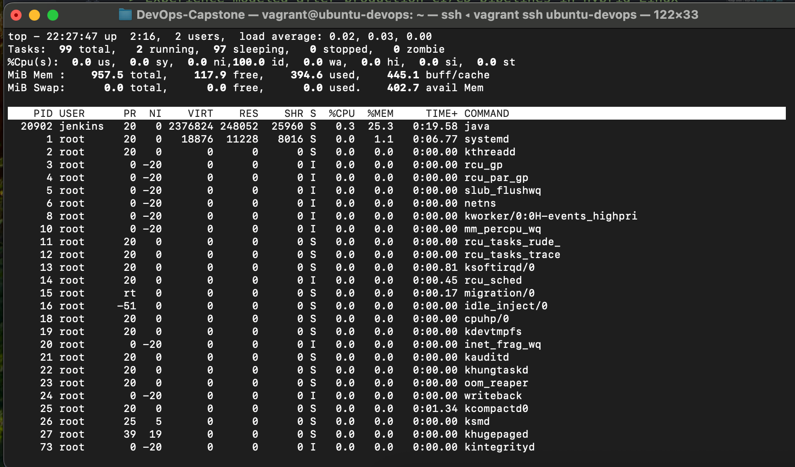
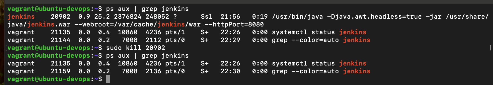
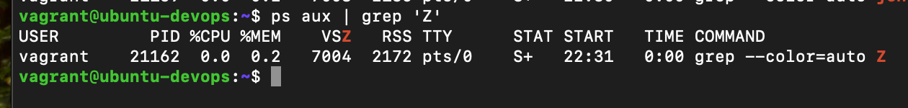
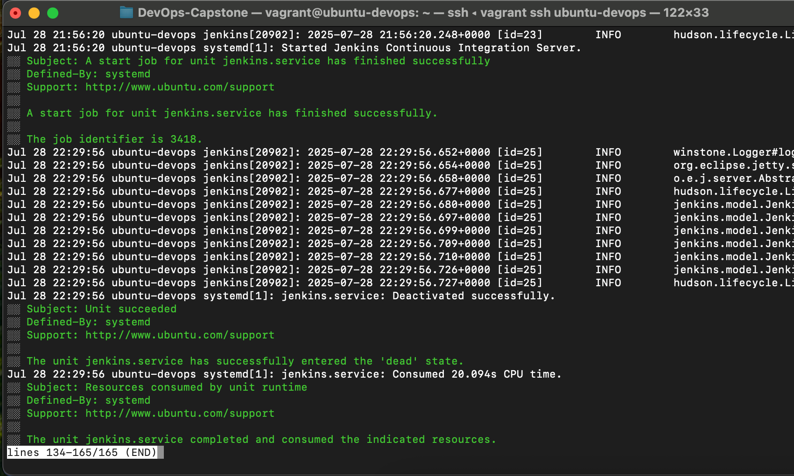
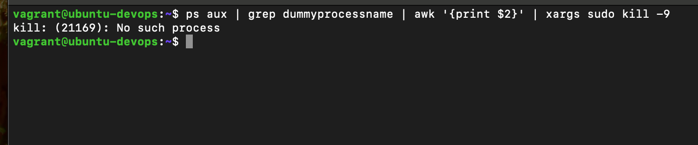

# FameTech DevOps Lab – Process Management & System Monitoring

> This lab simulates real-time Linux performance diagnostics and process recovery across staging environments. It includes monitoring CPU/memory usage, killing rogue processes, detecting zombies, analyzing service trees, and using filters like awk, xargs, and grep to automate incident resolution — essential for any DevOps engineer managing cloud VMs or bare-metal servers.

---

## About This Project

As a DevOps Engineer at FameTech NYC, working with simulated CloudVerse Corp infrastructure, I was responsible for diagnosing system load issues reported by QA. I executed monitoring routines, isolated high-CPU processes, handled zombie/orphan processes, and ensured services recovered smoothly — while documenting for compliance.

---

## Lab Metadata

| Key          | Value                                                                   |
| ------------ | ----------------------------------------------------------------------- |
| Lab Title    | Process Management & System Monitoring                                  |
| Lab ID       | CV-LAB-004                                                              |
| Company      | CloudVerse Corp                                                         |
| Engineer     | Sheikh Ahmed                                                            |
| Sprint       | Sprint 6                                                                |
| Environments | CentOS 7, Ubuntu 22.04                                                  |
| Tools Used   | top, htop, ps, kill, xargs, awk, journalctl, uptime, netstat, systemctl |

---

## Ticket: CV-DEVOPS-103

Jenkins and Apache (httpd) services occasionally become unresponsive after deployment bursts in staging.  
You’re tasked to:

- Monitor real-time system usage (CPU, memory, load average)
- Identify and kill rogue processes
- Detect and resolve zombie/orphan processes
- Bulk terminate services using filters
- Simulate outages and confirm recovery flows

---

## Implementation Steps

### Step 1: Live Resource Monitoring

```bash
top                     # Live CPU & memory stats
htop                    # Enhanced viewer (if installed)
uptime                  # Check system load average (1m, 5m, 15m)
```

Look for:

- High load average (e.g., >2 on a single-core system)
- Memory usage spikes
- Zombie processes (Z state)

---

### Step 2: View and Sort Processes

```bash
ps aux --sort=-%cpu | head     # Top CPU
ps aux --sort=-%mem | head     # Top memory
ps -ef                         # Parent-child tree
```

---

### Step 3: Simulate a Rogue Process

In a second shell:

```bash
while true; do echo "hogging CPU"; done
```

In another terminal:

```bash
ps aux | grep "hogging"
kill <PID>
kill -9 <PID>   # If the process doesn't respond
```

---

### Step 4: Identify & Handle Zombies and Orphans

```bash
ps aux | grep 'Z'    # Detect zombies
```

Create an orphan process:

```bash
systemctl start httpd     # or apache2
ps -ef | grep httpd       # Find parent PID
kill <PARENT_PID>         # Child adopted by PID 1 (systemd)
```

To clear zombie processes:

```bash
sudo reboot
```

---

### Step 5: Bulk Kill by Service Name

```bash
ps aux | grep jenkins | grep -v grep | awk '{print $2}' | xargs kill -9
```

Explanation:

- `ps aux` lists all processes
- `grep` filters for service name
- `awk '{print $2}'` gets the PID
- `xargs kill -9` force kills all matching processes

---

### Step 6: Service Recovery and Log Review

```bash
systemctl start jenkins
systemctl status jenkins
journalctl -u jenkins -xe
```

---

## Validation Screenshots

| Step              | Screenshot                                  | Notes                     |
| ----------------- | ------------------------------------------- | ------------------------- |
| top / htop        |                 | System usage live         |
| ps aux            |         | Before rogue process kill |
| Zombie Check      |           | Zombie detection          |
| journalctl        |          | Jenkins recovery logs     |
| xargs kill output |  | Bulk kill confirmation    |

---

## Validation Checklist

- [ ] CPU and memory load monitored via `top`, `htop`, `uptime`
- [ ] Created and terminated a rogue process
- [ ] Identified and simulated zombie/orphan processes
- [ ] Performed bulk process kill using `awk` and `xargs`
- [ ] Restarted and verified services (Jenkins, httpd)

---

## Interview Q\&A

**Q: What is a zombie process?**  
A: A process that has completed execution but hasn’t been removed from the process table by its parent.

**Q: How do you bulk kill processes safely?**  
A: Use `ps aux | grep` with `awk '{print $2}'` and `xargs kill` to target specific PIDs.

**Q: What's the difference between `kill` and `kill -9`?**  
A: `kill` sends SIGTERM (graceful shutdown); `kill -9` sends SIGKILL (forceful termination that can’t be trapped).

**Q: How do you identify parent-child process relationships?**  
A: Use `ps -ef` and review the PPID (parent process ID) column.

---

## Real-World Notes

- DevOps teams use `top`, `htop`, and `journalctl` during on-call rotations and performance incidents.
- Zombie processes indicate unhandled child processes — often due to missing `wait()` in the parent code.
- Orphan processes are adopted by `systemd` and can still run, but may cause issues if unmanaged.
- Never use `kill -9` on databases or critical services without evaluating the impact.

---
