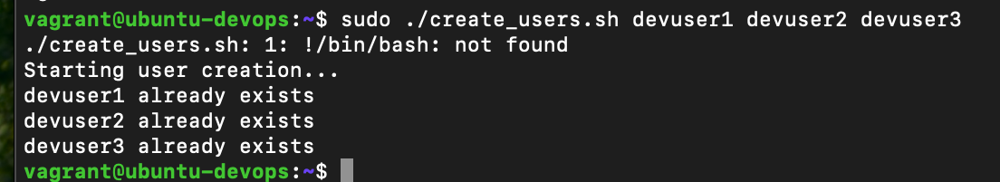
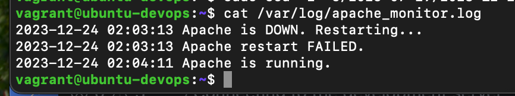
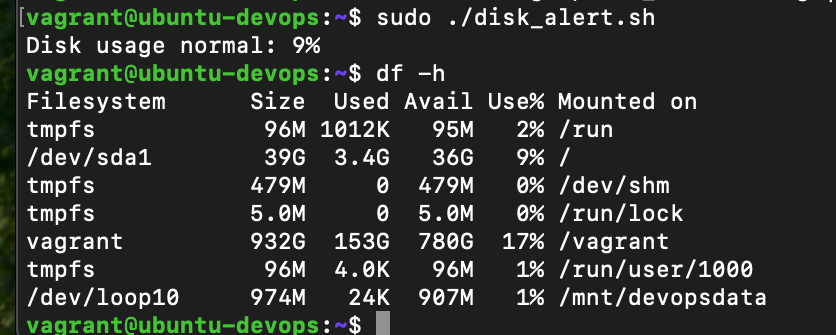
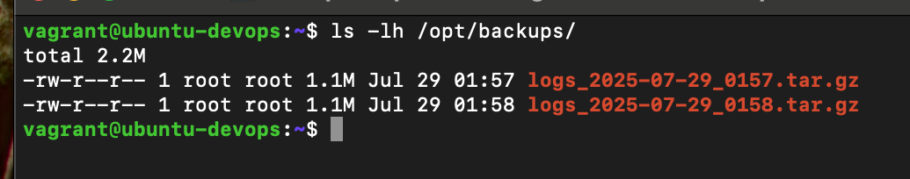

# FameTech DevOps Lab – Bash Scripting for Real-World DevOps Automation

> This hands-on lab demonstrates how to automate user creation, service monitoring, backup routines, and disk health checks using modular Bash scripts — mimicking the kind of internal tooling a DevOps engineer would develop at a mid-to-large enterprise like CloudVerse Corp.

---

## About This Project

As a Junior DevOps Engineer at FameTech NYC, I was assigned to automate repeated system admin tasks for CloudVerse Corp's Linux VM fleet. I wrote shell scripts for service health monitoring, user onboarding, backup rotation, and disk usage alerts — all following best practices for production-readiness.

> Scripts were designed with parameter inputs, logging, reusable functions, and sudo compatibility.

---

## Lab Metadata

| Key          | Value                                           |
| ------------ | ----------------------------------------------- |
| Lab Title    | Bash Scripting for Real-World DevOps Automation |
| Lab ID       | CV-LAB-005                                      |
| Company      | CloudVerse Corp                                 |
| Engineer     | Sheikh Ahmed                                    |
| Sprint       | Sprint 7                                        |
| Environments | CentOS 7, Ubuntu 22.04                          |
| Tools Used   | Bash, if, for, $@, $?, functions, set -e, cron  |

---

## Ticket: CV-DEVOPS-104

QA and Ops teams are overwhelmed with manual tasks like user onboarding, monitoring Apache uptime, and checking disk health. You’ve been tasked to:

- Automate user creation using loops and CLI arguments
- Monitor services and auto-recover if they fail
- Log all health check output
- Run disk usage checks and trigger alerts
- Apply scripting best practices (`set -e`, functions, exit codes)

---

## Script 1: Bulk User Creation (`create_users.sh`)

```bash
#!/bin/bash
# Create multiple users passed as arguments

set -e
echo "Starting user creation..."

for user in "$@"; do
  id "$user" &>/dev/null
  if [ $? -eq 0 ]; then
    echo "$user already exists"
  else
    useradd "$user"
    echo "$user created"
  fi
done
```

**Example:**

```bash
sudo ./create_users.sh jenkins ansible awscli
```

---

## Script 2: Apache Monitor with Logging (`apache_monitor.sh`)

```bash
#!/bin/bash
# Monitor Apache and restart if stopped

LOG_FILE="/var/log/apache_monitor.log"
TIMESTAMP=$(date '+%Y-%m-%d %H:%M:%S')

if pidof apache2 > /dev/null || pidof httpd > /dev/null; then
  echo "$TIMESTAMP Apache is running." >> "$LOG_FILE"
else
  echo "$TIMESTAMP Apache is DOWN. Restarting..." >> "$LOG_FILE"
  systemctl restart apache2 || systemctl restart httpd
  if [ $? -eq 0 ]; then
    echo "$TIMESTAMP Apache restarted successfully." >> "$LOG_FILE"
  else
    echo "$TIMESTAMP Apache restart FAILED." >> "$LOG_FILE"
  fi
fi
```

**Crontab Setup (runs every 5 minutes):**

```bash
*/5 * * * * /usr/local/bin/apache_monitor.sh
```

---

## Script 3: Disk Usage Alert (`disk_alert.sh`)

```bash
#!/bin/bash
# Alert if root disk usage exceeds threshold

THRESHOLD=80
USAGE=$(df / | grep / | awk '{print $5}' | sed 's/%//g')

if [ "$USAGE" -gt "$THRESHOLD" ]; then
  echo "ALERT: Disk usage is ${USAGE}% on root partition!"
else
  echo "Disk usage normal: ${USAGE}%"
fi
```

---

## Script 4: Backup /var/log to /opt/backups (`log_backup.sh`)

```bash
#!/bin/bash
# Backup log directory with timestamped archive

set -e
mkdir -p /opt/backups
TIMESTAMP=$(date +%F_%H%M)
tar -czvf /opt/backups/logs_$TIMESTAMP.tar.gz /var/log/
```

---

## Best Practices Followed

- `#!/bin/bash` specified for shell interpreter
- `set -e` used for fail-fast execution
- All scripts accept CLI arguments using `$@`
- Log output written with timestamps
- Separation of logic using functions (where applicable)
- Designed for root execution or sudo environments

---

## Validation Screenshots

| Step                | Screenshot                                | Notes                                       |
| ------------------- | ----------------------------------------- | ------------------------------------------- |
| User creation       |       | Terminal output of user creation            |
| Apache monitor logs |       | Output of `cat /var/log/apache_monitor.log` |
| Disk alert          |        | Terminal output when threshold exceeded     |
| Backup archive      |  | Output of `ls -lh /opt/backups/`            |

---

## Validation Checklist

- [ ] Users created dynamically using script arguments
- [ ] Apache monitored and auto-recovered with logging
- [ ] Disk usage alert triggered with test condition
- [ ] Timestamped backup stored under `/opt/backups`

---

## Interview Q\&A

**Q: Why use `$@` instead of hardcoding usernames?**  
A: It makes the script reusable and dynamic — supports bulk onboarding across teams or environments.

**Q: What does `set -e` do in Bash?**  
A: Causes the script to exit immediately upon encountering any error — helps prevent cascading failures.

**Q: How do you check if a service is running in a Bash script?**  
A: Use `pidof servicename` or `systemctl is-active servicename` in a conditional check.

**Q: Difference between `$1`, `$@`, and `$*`?**
A: `$1` is the first argument, `$@` expands all arguments individually, and `$*` expands all arguments as one string.

---

## Real-World Notes

- These scripts simulate foundational DevOps tooling used for automation and health monitoring.
- In production, service monitors would forward alerts to monitoring tools like Prometheus, Slack, or PagerDuty.
- Scripts like these are often executed via cron, systemd timers, or included in CI/CD pipelines.
- Version control and access restrictions should be applied when deploying automation scripts in real environments.

---
