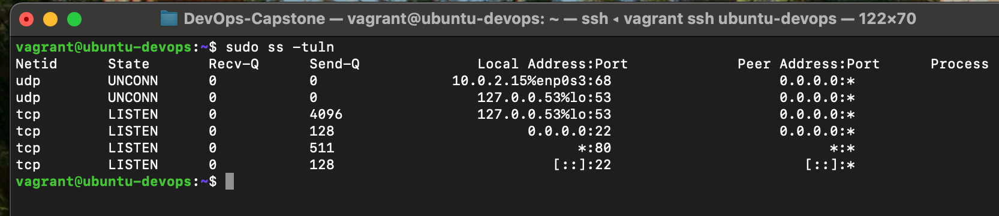
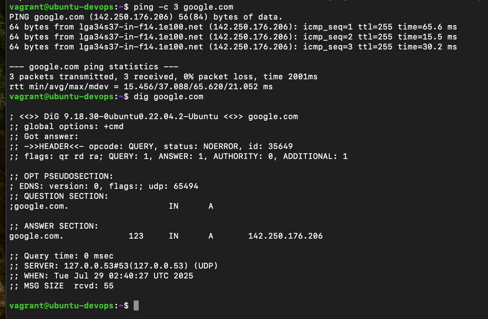
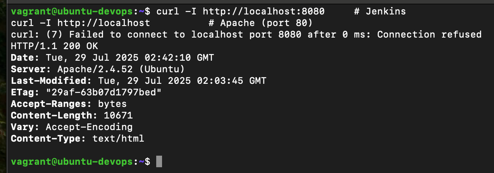
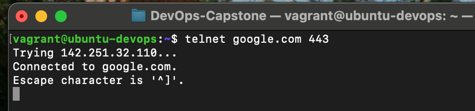
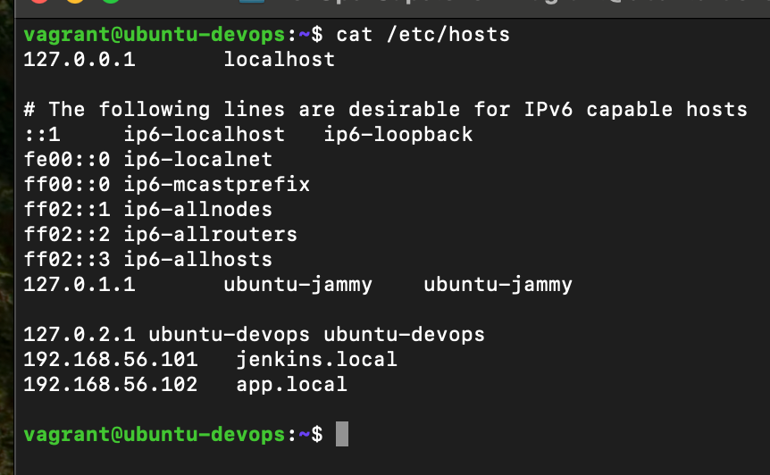

# FameTech DevOps Lab – Networking, DNS & Service Reachability

> This hands-on lab demonstrates how to diagnose Linux network issues using essential DevOps networking tools such as ping, traceroute, ss, telnet, dig, and curl. This is critical for debugging service outages, validating deployments, and diagnosing DNS issues across cloud and on-prem environments.

---

## About This Project

While working at FameTech NYC, simulating a hybrid infrastructure for CloudVerse Corp, I was responsible for diagnosing outages involving web and SSH services. I leveraged key network tools to trace packet flow, validate DNS, verify open ports, and pinpoint failures between services and VMs.

> Tools used are exactly what you'd use on EC2s, staging environments, or container hosts.

---

## Lab Metadata

| Key          | Value                                                                                    |
| ------------ | ---------------------------------------------------------------------------------------- |
| Lab Title    | Networking, DNS & Service Reachability                                                   |
| Lab ID       | CV-LAB-006                                                                               |
| Company      | CloudVerse Corp                                                                          |
| Engineer     | Sheikh Ahmed                                                                             |
| Sprint       | Sprint 7                                                                                 |
| Environments | CentOS 7, Ubuntu 22.04                                                                   |
| Tools Used   | ping, ss, netstat, curl, telnet, dig, nslookup, traceroute, /etc/resolv.conf, /etc/hosts |

---

## Ticket: CV-DEVOPS-105

Jenkins and web app deployments are randomly failing to connect to internal services. You are assigned to:

- Validate service ports are open and reachable
- Trace packet route to backend VMs
- Resolve DNS failures using `dig` and `/etc/resolv.conf`
- Check system hostname configuration
- Simulate real-world port access tests with `telnet` and `curl`

---

## Implementation Steps

### Step 1: Check Hostname & Interface Info

```bash
hostnamectl
ip a
```

Confirm that hostname is correct and network interface is UP with IP assigned.

---

### Step 2: Test Basic Network Connectivity

```bash
ping -c 3 8.8.8.8          # Ping external IP (Google DNS)
ping -c 3 google.com       # DNS resolution test
```

If IP ping works but domain fails, it's a DNS issue.

---

### Step 3: Analyze Listening Ports

```bash
ss -tuln
netstat -tuln
```

Check for open ports like:

- Jenkins (8080)
- Apache (80)
- SSH (22)

---

### Step 4: Check Service Reachability

```bash
telnet localhost 22
telnet localhost 80
```

If telnet fails, it may indicate the service is down, the port is blocked, or a firewall issue exists.

---

### Step 5: Validate DNS Resolution

```bash
dig google.com
nslookup github.com
cat /etc/resolv.conf
```

Verify that nameservers like `8.8.8.8` or your internal DNS are correctly configured.

---

### Step 6: Use Curl to Test Services

```bash
curl http://localhost:8080
curl http://localhost
```

Output confirms service availability and status codes like `200 OK` or `connection refused`.

---

### Step 7: Trace Route to Remote Server

```bash
traceroute github.com
```

Helps identify slow or broken hops in the network path.

---

### Step 8: Modify /etc/hosts for Local DNS Override

```bash
sudo vim /etc/hosts
```

Add:

```
192.168.56.101   jenkins.local
192.168.56.102   app.local
```

Useful for internal testing when DNS is not configured.

---

## Validation Screenshots

| Step       | Screenshot                           | Notes                                       |
| ---------- | ------------------------------------ | ------------------------------------------- |
| ss/netstat |     | Show open listening ports                   |
| ping/dig   |   | Show success/failure in connectivity or DNS |
| curl       |    | Jenkins or Apache response status           |
| telnet     |     | Port reachable/unreachable test             |
| /etc/hosts |  | Manual DNS override example                 |

---

## Validation Checklist

- [ ] Hostname and IP confirmed using `hostnamectl` and `ip a`
- [ ] Internet and DNS ping tested with `ping` and `dig`
- [ ] Listening services verified with `ss` or `netstat`
- [ ] Port reachability tested with `telnet` and `curl`
- [ ] DNS resolution verified via `dig` and `/etc/resolv.conf`
- [ ] Custom host entries added in `/etc/hosts`

---

## Interview Q\&A

**Q: What’s the difference between ping and telnet?**  
A: `ping` tests basic ICMP connectivity, while `telnet` checks TCP-level access to a specific port.

**Q: Jenkins not reachable — how do you debug it?**
A: Check open ports with `ss`, service logs with `journalctl`, use `curl` and `telnet` to verify port 8080.

**Q: What file controls DNS servers in Linux?**
A: `/etc/resolv.conf`

**Q: Why would DNS resolve IP but curl still fail?**  
A: Possible causes: the service is not running, wrong port, firewall blocking access, or SELinux restrictions.

---

## Real-World Notes

- These commands are standard for incident response and are often used by SREs and DevOps engineers.
- In AWS, EC2 instances may lose DNS after reboot if `/etc/resolv.conf` is misconfigured or DHCP settings are missing.
- `curl` is often used in load balancer health checks and deployment scripts.
- `/etc/hosts` is critical in staging environments where DNS isn’t yet integrated or for overriding external domains temporarily.

---
