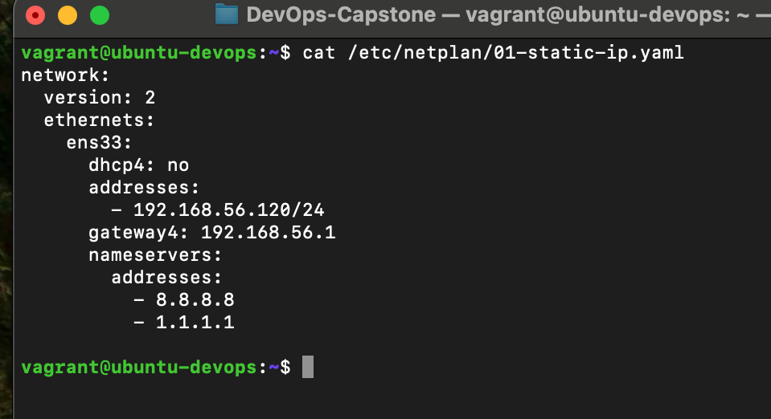
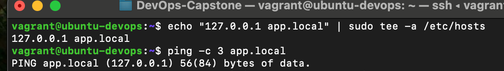

# FameTech DevOps Lab – Static IP, Gateway, DNS & Persistent Connectivity (Ubuntu)

> This lab demonstrates how to manually configure a static IP address, gateway, DNS, and verify persistent network connectivity on Ubuntu 22.04 using Netplan. These steps simulate real-world scenarios like configuring non-DHCP AWS subnets, private VPCs, or staging VMs with static internal IPs.

---

## About This Project

As part of my DevOps engineering role at FameTech NYC, simulating hybrid infrastructure for CloudVerse Corp, I was responsible for configuring static IP networking on Ubuntu VMs. The task involved setting static addresses using Netplan, verifying routing tables, managing DNS resolvers, and ensuring connectivity remained after reboot — all crucial in private subnets or isolated staging environments.

> This mirrors best practices for EC2s, backend servers, and lab networks that require consistent addressing.

---

## Lab Metadata

| Key         | Value                                                                           |
| ----------- | ------------------------------------------------------------------------------- |
| Lab Title   | Static IP, Gateway, DNS & Persistent Connectivity                               |
| Lab ID      | CV-LAB-007                                                                      |
| Company     | CloudVerse Corp                                                                 |
| Engineer    | Sheikh Ahmed                                                                    |
| Sprint      | Sprint 8                                                                        |
| Environment | Ubuntu 22.04                                                                    |
| Tools Used  | `ip`, `netplan`, `/etc/resolv.conf`, `ping`, `traceroute`, `nmcli`, `systemctl` |

---

## Ticket: CV-DEVOPS-106

CloudVerse’s internal app servers fail to maintain stable networking due to dynamic IPs. Your job is to:

- Assign a static IP, DNS, and gateway using Netplan
- Ensure the settings persist after reboot
- Validate the routing and DNS functionality
- Use `/etc/hosts` for internal name resolution simulation

---

## Implementation Steps (Ubuntu)

### Step 1: Check Current Network Info

```bash
ip a
ip route
hostnamectl
```

Identify your primary interface (e.g., `ens33`, `enp0s3`, or `eth0`).

---

### Step 2: Create Netplan Config for Static IP

```bash
sudo vim /etc/netplan/01-static-ip.yaml
```

Paste the following and replace with your values:

```yaml
network:
  version: 2
  ethernets:
    ens33:
      dhcp4: no
      addresses:
        - 192.168.56.120/24
      gateway4: 192.168.56.1
      nameservers:
        addresses:
          - 8.8.8.8
          - 1.1.1.1
```

Then apply:

```bash
sudo netplan apply
```

---

### Step 3: Validate IP & DNS Settings

```bash
ip a
ip route
cat /etc/resolv.conf
ping 8.8.8.8
ping google.com
```

You should see:

- Static IP correctly assigned
- Routing table with `default via` your gateway
- Working DNS resolution

---

### Step 4: Lock DNS Config (For Labs Only)

If `/etc/resolv.conf` gets reset on reboot (by NetworkManager or cloud-init), run:

```bash
sudo chattr +i /etc/resolv.conf
```

Note: Do not use this in production — manage DNS via Netplan or NetworkManager.

---

### Step 5: Modify /etc/hosts for Custom Resolution

```bash
sudo vim /etc/hosts
```

Add entries for local testing:

```
192.168.56.120  app.local
192.168.56.110  db.local
```

Test:

```bash
ping app.local
```

---

## Validation Screenshots

| Step            | Screenshot                                 | Description                                |
| --------------- | ------------------------------------------ | ------------------------------------------ |
| Netplan config  |  | Static IP, gateway, DNS in YAML            |
| IP check        |             | `ip a` showing assigned static IP          |
| Routing check   |       | `ip r` showing correct default gateway     |
| DNS test        |            | `ping` or `dig` output resolving DNS       |
| /etc/hosts test |    | `ping app.local` resolving via local hosts |

---

## Validation Checklist

- [ ] Static IP configured using Netplan
- [ ] Gateway and DNS servers applied and verified
- [ ] DNS works after reboot (resolv.conf intact)
- [ ] Routing table shows default via correct gateway
- [ ] Hostname overrides tested via `/etc/hosts`

---

## Interview Q\&A

**Q: Where is the static IP configured in Ubuntu 22.04?**  
A: Inside Netplan YAML files located in `/etc/netplan/`.

**Q: Why use Netplan over ifconfig or editing `/etc/network/interfaces`?**  
A: Netplan is the modern default in Ubuntu 18.04+; older tools are deprecated.

**Q: What happens if your Netplan YAML has errors?**  
A: Your network may fail to initialize. Always validate and keep console access.

**Q: Why would you use `/etc/hosts` in staging?**  
A: To simulate DNS entries for internal apps or when DNS is not yet deployed.

---

## Real-World Notes

- Netplan is required for cloud VMs, cloud-init, and LXD containers in Ubuntu
- Static IPs are used for backend services, RDS databases, and internal APIs
- Misconfigured Netplan can block SSH — always test in a VM or snapshot environment
- DevOps engineers often automate Netplan updates using Ansible or cloud-init templates

---
